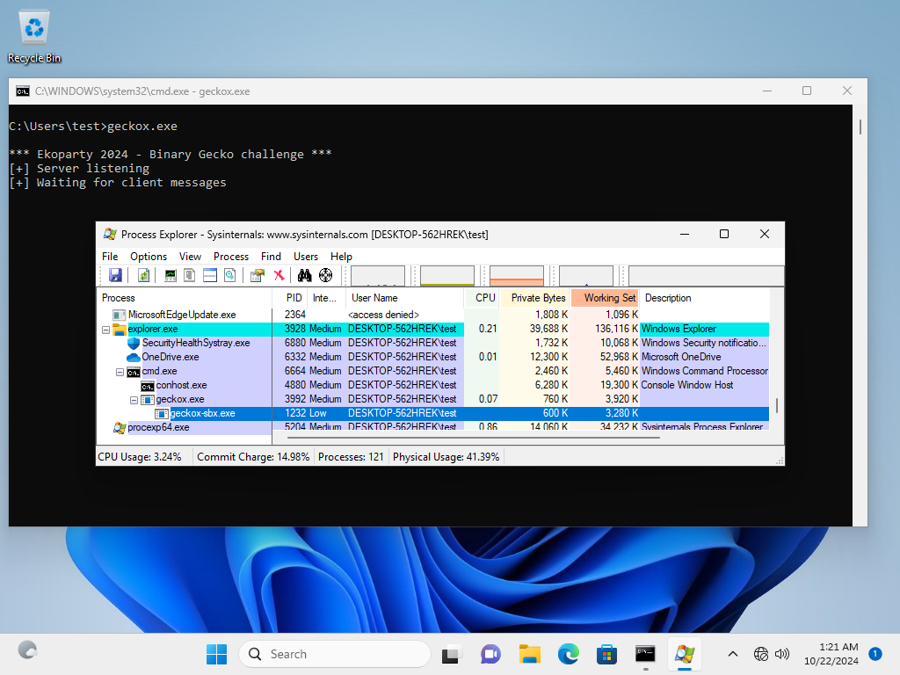
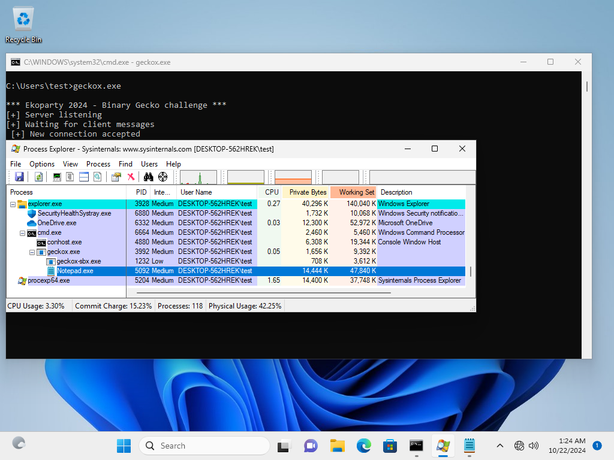

<h1 align="center">Escape the Sandbox</h1>

The challenge consists of exploiting remotely the sandbox process ("geckox-sbx.exe"), and then, escalate privileges from it by exploiting the broker process ("geckox.exe").

## Solution:

The solution should be a full chain exploit written in Python and/or C without including external libraries (just default Python and C code which can be compiled with VS ("cl.exe")).

It should work on "Windows 10" and/or "Windows 11" with process continuation (preferably), where a Notepad ("notepad.exe") should be executed from the broker process running in Medium Integrity Level.

Basic Windows skills are necessary, and depending of your level, the solution could take between hours and two days.

## Instructions:

When executing the challenge ("geckox.exe"), just make sure the sandbox is located in the same directory. 

For the exploitation scenario, make sure the target machine has the "File and printer sharing" network feature enabled, where the attacker is able to write files remotely.

Good luck :)
